<div align="center">

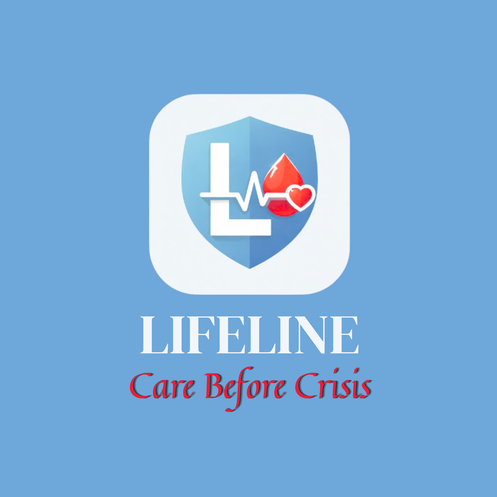

# LifeLine — Care Before Crisis

**A comprehensive personal health companion app built with Flutter & Firebase**

[](https://flutter.dev)
[](https://firebase.google.com)
[](https://dart.dev)
[](https://play.google.com)
[](LICENSE)

> 🏆 Built for a national health-tech hackathon — 10 features in one app, fully Firebase-backed

---

### [⬇️ Download APK](#download) • [📐 Architecture](#architecture) • [✨ Features](#features) • [🚀 Setup](#setup)

</div>

---

## 📱 Screenshots

| Splash | Login | Dashboard | Emergency SOS |
|--------|-------|-----------|---------------|
| 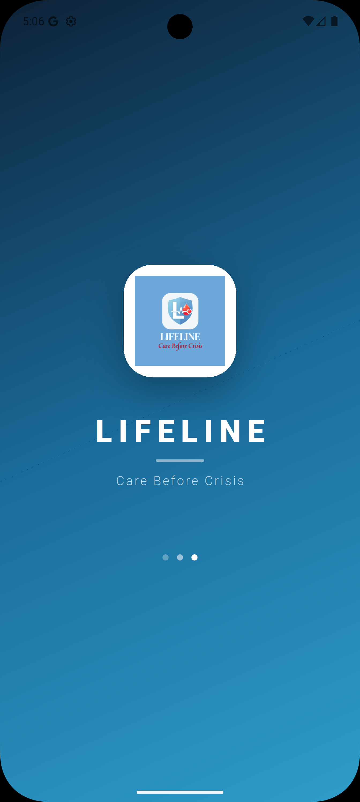 | 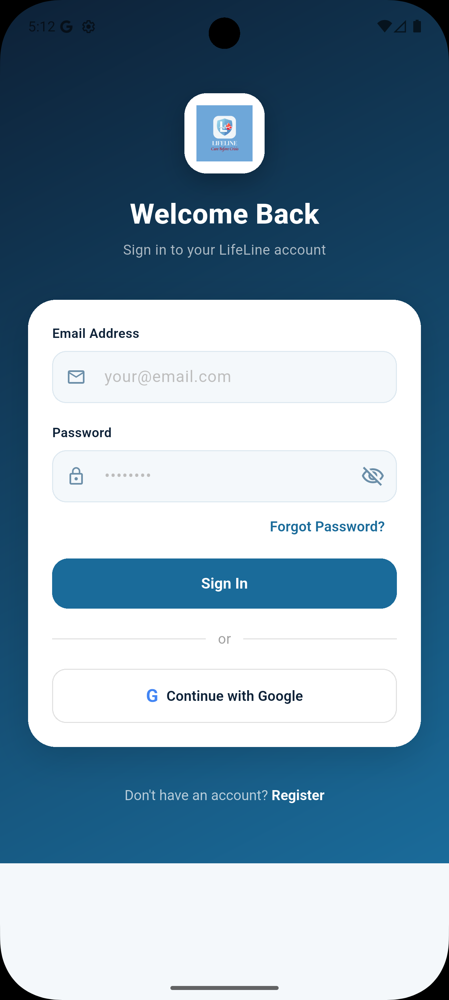 | 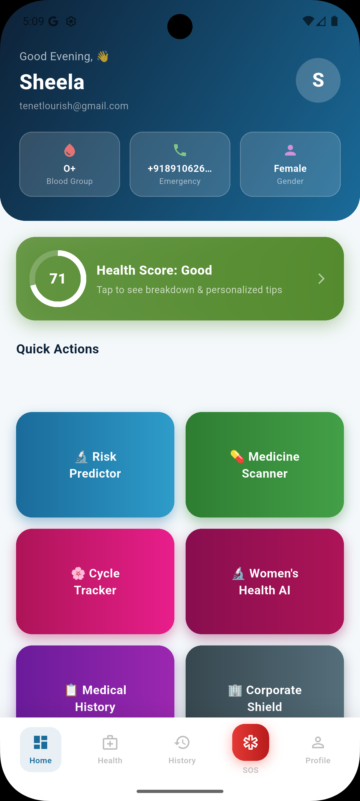 | 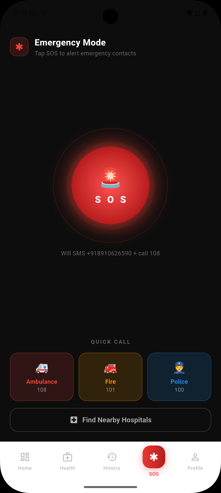 |

| Health Score | Medical History | Health Wallet QR | Profile |
|-------------|-----------------|-----------------|---------|
| 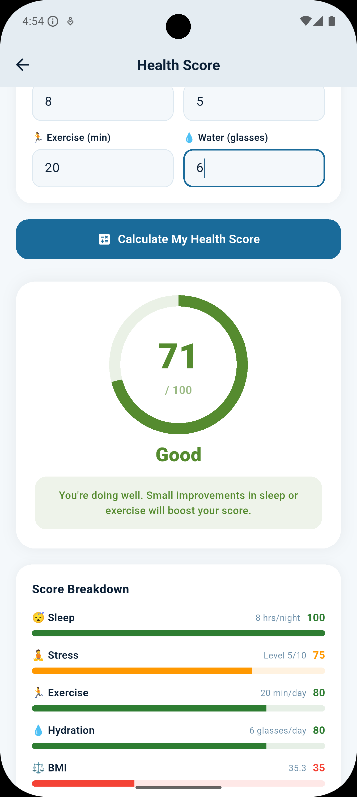 | 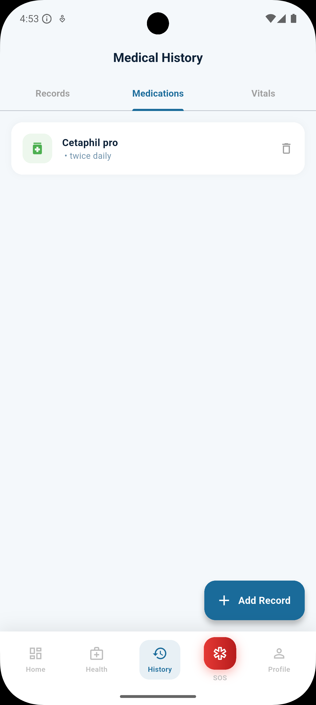 | 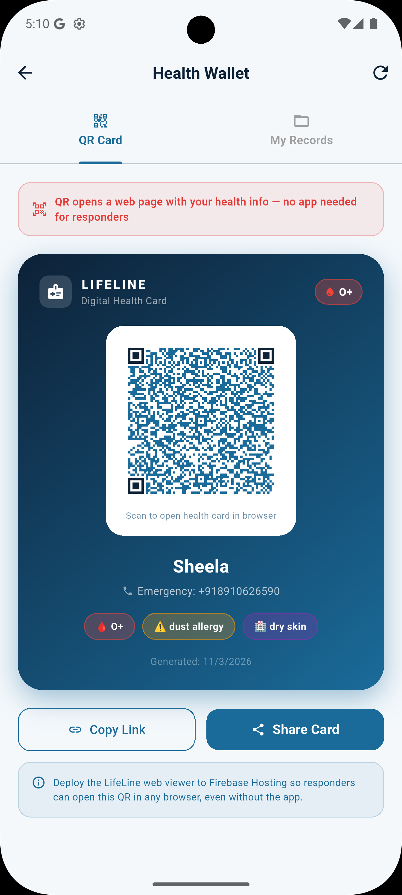 | 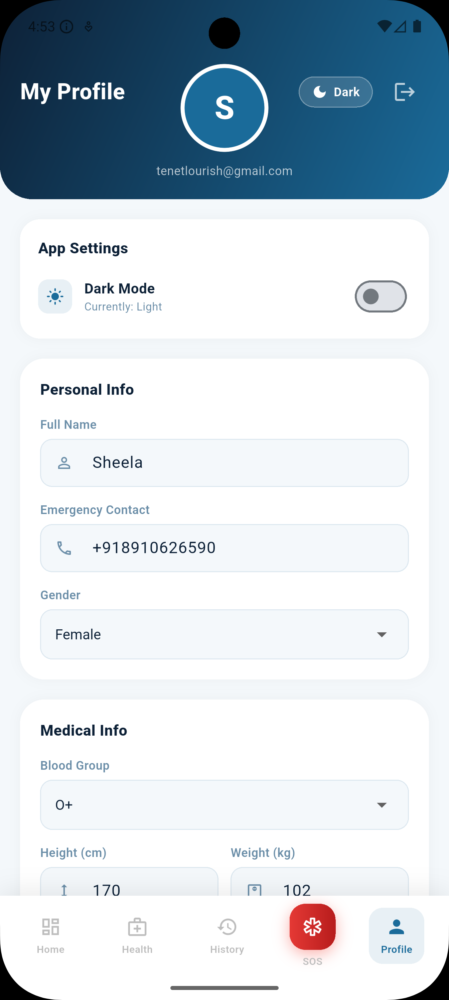 |

| BMI Calculator | First Aid Guide | Medicine Scanner | PCOS Risk AI |
|----------------|-----------------|-----------------|--------------|
| 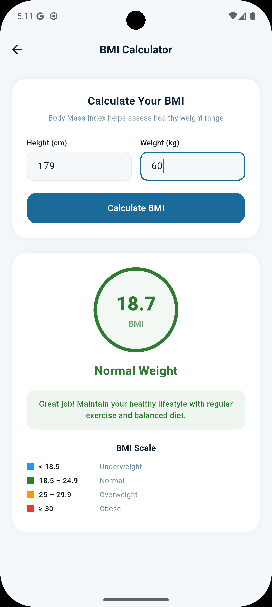 | 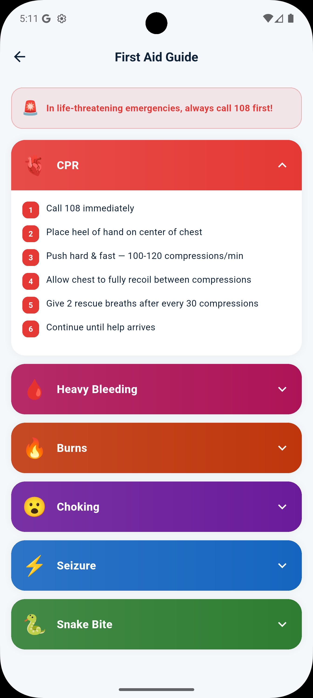 | 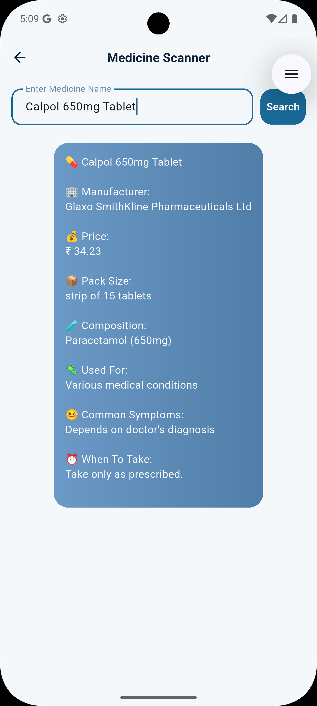 | 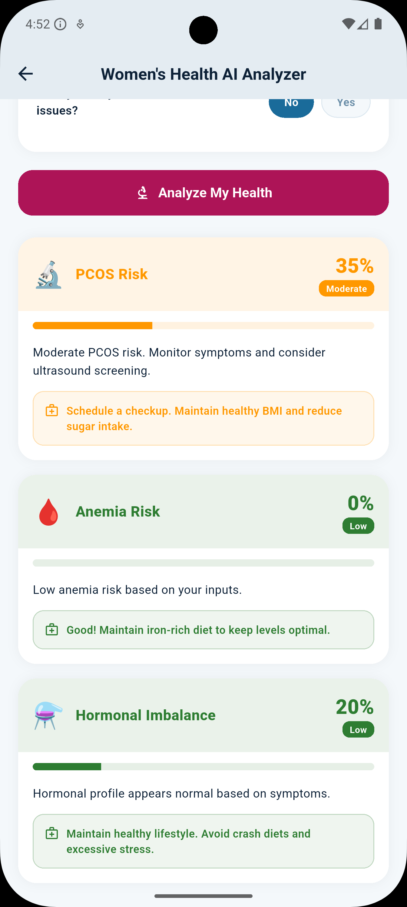 |

---

## ✨ Features

### 🏆 1. Dynamic Health Score
A composite **0–100 score** calculated from your vitals (BP, blood sugar), BMI, sleep hours, stress level, exercise minutes, and water intake. Score is saved to Firestore and displayed on your dashboard. Grades: **Critical → Poor → Fair → Good → Excellent**.

### 🔬 2. AI Risk Predictor
Enter age, blood pressure, blood sugar, weight, and height. A weighted scoring algorithm predicts **Low / Moderate / High** risk and lists possible conditions (Hypertension, Diabetes, Cardiovascular disease, Metabolic syndrome).

### 💊 3. Indian Medicine Scanner
Search from a **local JSON database** of Indian medicines. Live suggestions as you type. Displays manufacturer, price (₹), pack size, composition, indications, and timing advice. Fully offline.

### 🌸 4. Menstrual Cycle Tracker *(Female users only)*
Input your last period date and average cycle length. The app predicts your **next period**, **ovulation window**, and **fertile days**. Gender-gated — only visible to female users via Firestore profile check.

### 🔬 5. Women's Health AI — PCOS & Hormonal Risk *(Female users only)*
Multi-factor questionnaire covering cycle irregularity, acne, hair loss, weight changes, and stress. Returns **PCOS risk score**, Anemia risk, and Hormonal imbalance indicators with personalized advice.

### ⚖️ 6. BMI Calculator
Enter height and weight — get a **visual circle result** with color-coded category (Underweight / Normal / Overweight / Obese) and actionable health advice. Includes full BMI reference scale.

### 🩺 7. First Aid Guide *(Offline)*
Six expandable emergency guides: **CPR, Heavy Bleeding, Burns, Choking, Seizure, Snake Bite**. Each has numbered step-by-step instructions with color-coded severity. No internet required.

### 🔐 8. Health Wallet — QR Code
Generates a **QR code containing all critical health data** (name, blood group, emergency contact, allergies, chronic conditions) encoded as JSON. For emergency responders to scan instantly.

### 🚨 9. Emergency SOS
Dark-mode screen with pulsing SOS button. One tap: **sends SMS with GPS location** to your emergency contact AND **calls 108** (Ambulance). Quick-dial buttons for 108, 101, 100. Find nearby hospitals via Maps.

### 📋 10. Medical History — Full CRUD
Three Firestore subcollections: **Records** (diagnosis, doctor, hospital, treatment), **Medications** (name, dosage, frequency), **Vitals** (BP, sugar, heart rate, weight). Add, view, and delete entries. Streamed in real-time.

### 🏢 11. Corporate Health Shield *(B2B Feature)*
Anonymous organizational health analytics dashboard. Shows org-wide health score, burnout risk %, stress levels, BMI distribution, and anemia risk across the workforce — without exposing individual data.

### 🌓 12. Dark / Light Theme
Global theme toggle using a `ChangeNotifier`. Persists across the app via `themeNotifier`. All screens respect `isDark` for backgrounds, cards, text, and borders.

---

## 🏗️ Architecture

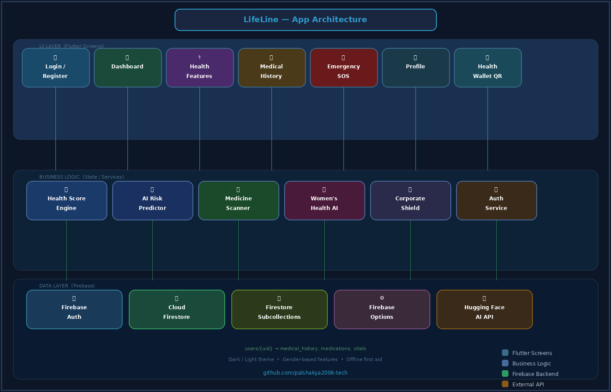

```
lib/
├── main.dart                    # Firebase init, AuthGate, ThemeNotifier, AppTheme extension
├── firebase_options.dart        # FlutterFire CLI generated config
├── screens/
│   ├── splash_screen.dart       # Animated logo + loading dots → AuthGate
│   ├── login_screen.dart        # Email/password + Google Sign-In + forgot password
│   ├── register_screen.dart     # 2-step form (Personal + Medical) → Firestore create
│   ├── home_screen.dart         # 5-tab IndexedStack bottom nav
│   ├── dashboard_screen.dart    # Gradient header, quick actions, recent records stream
│   ├── health_features_screen.dart  # Feature hub — gender-gated list
│   ├── health_score_screen.dart     # Composite score engine + animated ring
│   ├── risk_predictor_screen.dart   # Vitals → weighted risk %
│   ├── medicine_scanner_screen.dart # JSON search + live suggestions
│   ├── menstrual_tracker_screen.dart # Cycle prediction (Female only)
│   ├── pcos_risk_screen.dart         # Women's Health AI (Female only)
│   ├── bmi_calculator_screen.dart    # BMI formula + visual result
│   ├── first_aid_screen.dart         # 6 offline guides
│   ├── health_wallet_screen.dart     # QR code generator
│   ├── medical_history_screen.dart   # 3-tab CRUD + Firestore subcollections
│   ├── emergency_screen.dart         # SOS + pulse animation + SMS + call
│   ├── profile_screen.dart           # Edit profile → Firestore set(merge:true)
│   └── corporate_health_screen.dart  # B2B org analytics
└── widgets/
    └── feature_card.dart        # Gradient card with emoji + navigation
```

### Data Flow

```
User Action
    │
    ▼
Flutter Widget (StatefulWidget / setState)
    │
    ├──► FirebaseAuth  (login, register, Google Sign-In, email verification)
    │
    ├──► Firestore .set() / .update() / .collection().stream()
    │         └── users/{uid}
    │                 ├── medical_history/{docId}
    │                 ├── medications/{docId}
    │                 └── vitals/{docId}
    │
    └──► Local Computation
              ├── BMI calculation
              ├── Risk scoring (weighted algorithm)
              ├── Health score (7-factor composite)
              ├── Cycle prediction (date math)
              └── Medicine search (JSON asset)
```

---

## 🔥 Firebase Setup

| Service | Usage |
|---------|-------|
| **Firebase Auth** | Email/password, Google Sign-In, Email verification |
| **Cloud Firestore** | User profiles, medical history, vitals, medications |
| **Firestore Rules** | User-scoped: only `request.auth.uid == userId` |

### Firestore Security Rules
```javascript
rules_version = '2';
service cloud.firestore {
  match /databases/{database}/documents {
    match /users/{userId}/{document=**} {
      allow read, write: if request.auth != null
                         && request.auth.uid == userId;
    }
  }
}
```

---

## 📦 Dependencies

```yaml
dependencies:
  firebase_core: ^3.0.0
  firebase_auth: ^5.0.0
  cloud_firestore: ^5.0.0
  google_sign_in: ^6.0.0
  qr_flutter: ^4.1.0          # Health Wallet QR code
  url_launcher: ^6.3.2         # SOS calls + Maps
  geolocator: ^13.0.0          # GPS location for SOS
  shared_preferences: ^2.2.2
  http: ^1.2.0
  cupertino_icons: ^1.0.8
```

---

## <a name="download"></a>⬇️ Download

### Android APK

> > **[⬇️ Download LifeLine v1.0 APK](https://github.com/palshakya2006-tech/lifeline-app/releases/download/v1.0/app-release.apk)**

To install:
1. Download the APK file above
2. On your Android phone → **Settings → Security → Unknown Sources → Enable**
3. Open the downloaded APK and tap **Install**
4. Create an account or sign in

**Minimum Requirements:** Android 6.0+ • ~25 MB

---

## <a name="setup"></a>🚀 Local Setup

```bash
# 1. Clone the repo
git clone https://github.com/palshakya2006-tech/lifeline.git
cd lifeline

# 2. Install dependencies
flutter pub get

# 3. Set up Firebase
# - Create project at console.firebase.google.com
# - Enable Email/Password + Google Sign-In in Authentication
# - Create Firestore database (test mode → asia-south1)
# - Download google-services.json → android/app/
# - Run: flutterfire configure

# 4. Add assets
# Place these in assets/ folder:
# - lifeline_logo.png
# - lifeline_logo1.png
# - indian_medicine_data.json

# 5. Run
flutter run
```

---

## 🧑‍💻 Key Technical Highlights

- **`SetOptions(merge: true)`** — profile saves create document if missing, update if exists
- **`StreamBuilder`** on Firestore for real-time medical history updates
- **`IndexedStack`** for bottom nav (screens stay alive, no rebuild on tab switch)
- **`ChangeNotifier`** global theme notifier with `BuildContext` extension for consistent theming
- **`AnimationController`** for SOS pulse rings, splash logo, and health score ring
- **Gender-gated features** — PCOS and Cycle Tracker only appear for Female users (loaded from Firestore on app start)
- **Offline-capable** — First Aid Guide and Medicine Scanner work without internet

---

## 🏆 Hackathon Context

LifeLine was built for a national health-tech hackathon targeting:

- **SDG 3** — Good Health and Well-Being
- **Target audience** — Rural and semi-urban India (Indian medicine database, local emergency numbers 100/101/108)
- **B2B angle** — Corporate Health Shield for anonymous org-level health insights
- **Women's health** — PCOS risk + cycle tracker for underserved female health needs

---

## 👤 Authors

**Tamohar Das** · [@Tamohar20](https://github.com/Tamohar20)
**Saikat Dey** · [@saikat12april](https://github.com/saikat12april)
**Shankharav Pal** · [@palshakya2006-tech](https://github.com/palshakya2006-tech)
**Debarjun Chatterjee** · [@debxarjun](https://github.com/debxarjun)

Built with ❤️ using Flutter, Firebase, and a lot of caffeine.

---

<div align="center">
<sub>LifeLine — Care Before Crisis | MIT License</sub>
</div>
